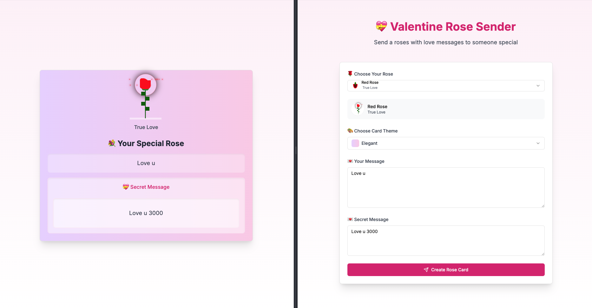

# Valentine Rose Sender 🌹

  

A delightful web application that lets users send virtual roses with personalized messages to their loved ones. Built with Next.js, TypeScript, and Firebase.

## Features ✨

- Choose from different rose types (Red, Pink, White, Yellow) each with unique meanings
- Select beautiful card themes
- Write personalized messages
- Add secret messages that can only be revealed with an access key
- Generate shareable links for recipients

## Tech Stack 🛠️

- **Frontend:**

  - Next.js 13
  - TypeScript
  - Tailwind CSS
  - Radix UI Components
  - Lucide React Icons

- **Backend:**
  - Firebase Firestore

## Credits 🙏

- [codepen](https://codepen.io/maaarj/pen/gmNeXd)
